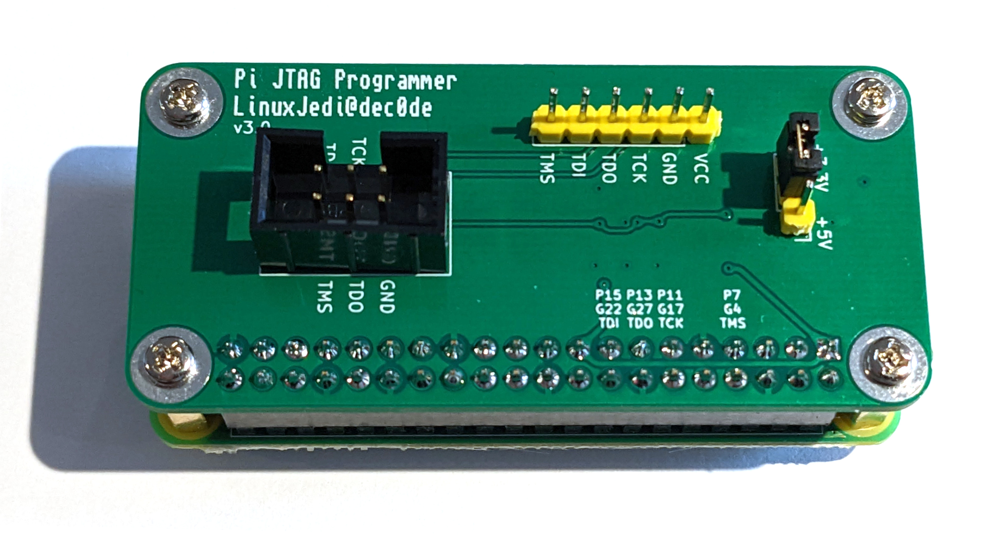

# Pi JTAG Scripts

This is a repository of scripts, configurations and information to use the Pi JTAG board. In this directory you can find the following.

 

## Get a Pi JTAG

You can purchase a Pi JTAG board from [Retro Supplies](https://www.retrosupplies.co.uk/development-tools/raspberry-pi-jtag-programmer).

## Pi JTAG Pinout

This is the GPIO pinout of the Pi JTAG for use with any JTAG software that can use the GPIO:

| Function | Pin Number | GPIO Number |
| -------- | ---------- | ----------- |
| TMS      | 7          | 4           |
| TCK      | 11         | 17          |
| TDO      | 13         | 27          |
| TDI      | 15         | 22          |

## Software

### [xc3sprog](xc3sprog/README.md)

Build information and instructions to use xc3sprog with your project.

### [OpenOCD](OpenOCD/README.md)

Instructions and configuration files for OpenOCD.

### [UrJTAG](UrJTAG/README.md)

Build information and cable config instructions for UrJTAG
